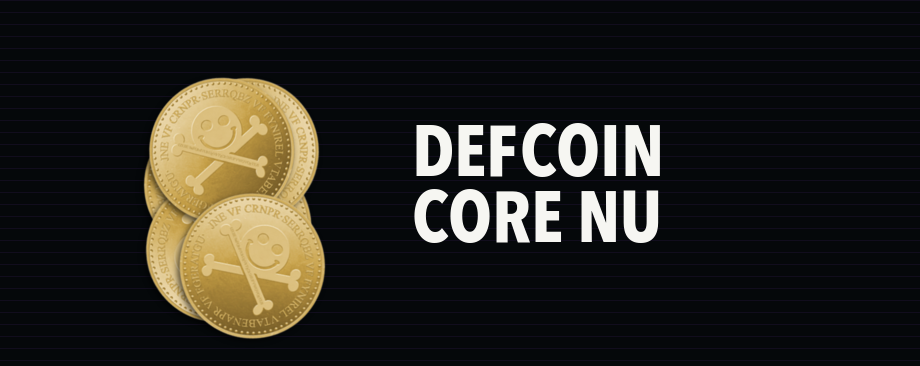
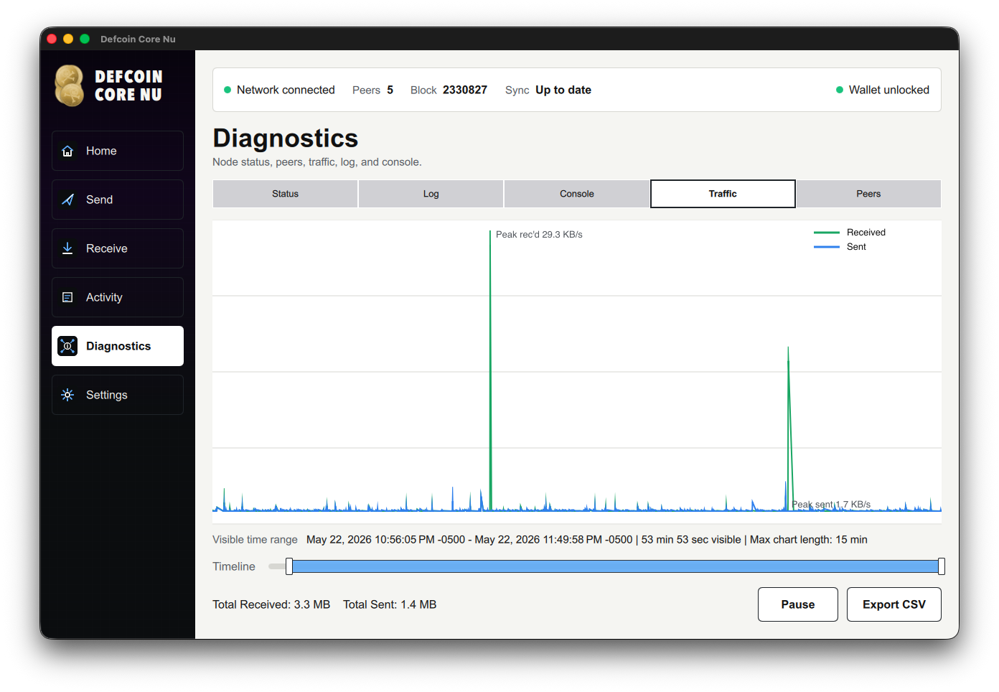
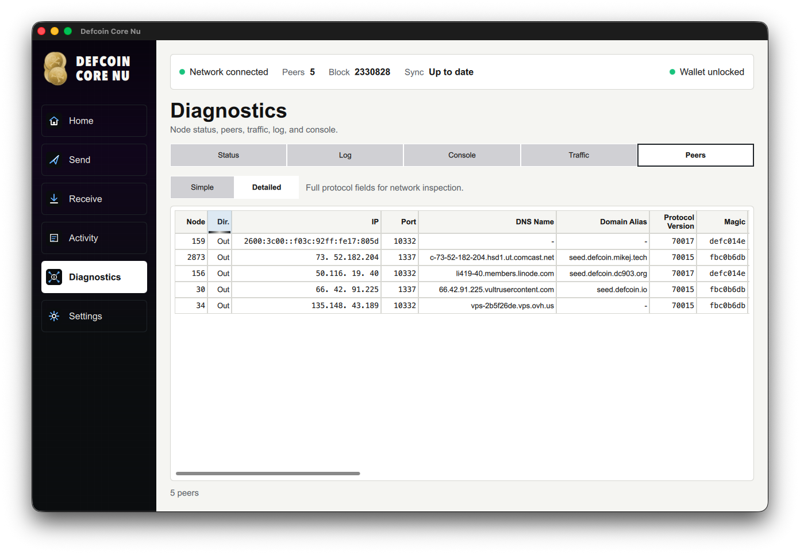
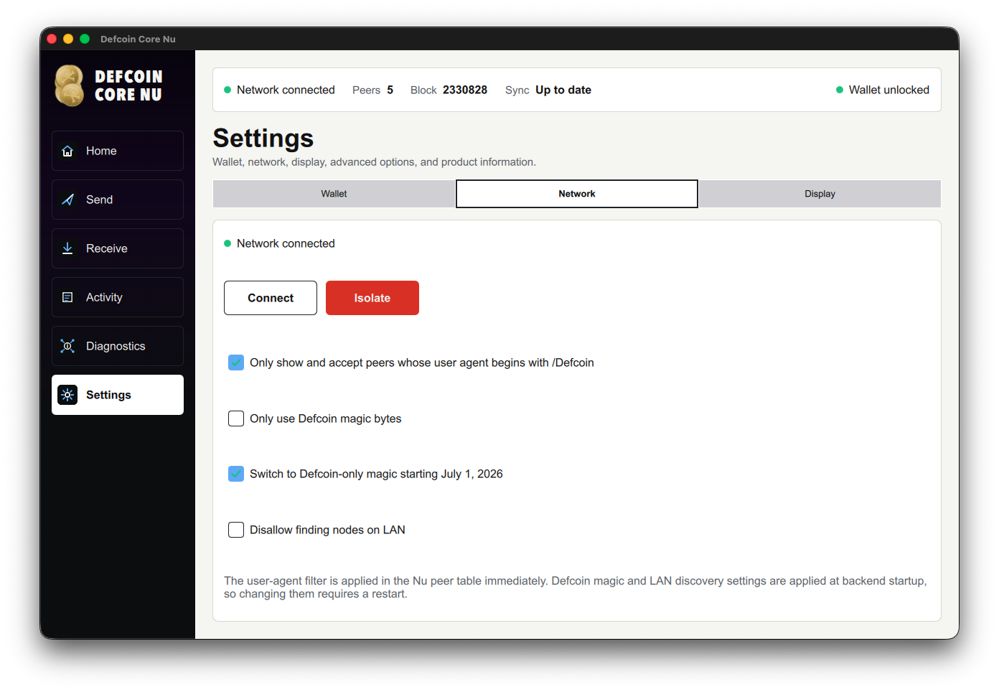

<p align="center">
  
</p>

<h1 align="center">Defcoin Core Nu</h1>

<p align="center">
  <strong>Download a Defcoin wallet. Store DFC. Send and receive DFC on the Defcoin network.</strong>
</p>

<p align="center">
  <a href="https://github.com/defcoincore/Defcoin-Core-Nu/releases/tag/v26.3.1"><strong>Download Wallet</strong></a>
  ·
  <a href="#build-from-source">Build from source</a>
  ·
  <a href="source/doc/defcoin-core-nu-technical-guide.md">Technical guide</a>
  ·
  <a href="source/doc/release-notes/release-notes-26.3.1.md">Release notes</a>
</p>

Defcoin is a Scrypt proof-of-work cryptocurrency with a long-running independent
chain. Defcoin Core Nu is the current full-node desktop wallet for holding DFC,
sending and receiving payments, inspecting network peers, and participating in
the Defcoin network.

The `26.3.1` release, codename `Core Memories`, preserves Defcoin's historical
chain rules and wallet data while adding a focused Qt Quick desktop experience
for modern macOS and Windows users.

## Get The Wallet

Choose the package for your computer from
[Defcoin Core Nu 26.3.1 "Core Memories"](https://github.com/defcoincore/Defcoin-Core-Nu/releases/tag/v26.3.1).

| Platform | Package |
| --- | --- |
| macOS Apple Silicon | [DMG](https://github.com/defcoincore/Defcoin-Core-Nu/releases/download/v26.3.1/Defcoin-Core-Nu-v26.3.1-macOS-AppleSilicon.dmg) |
| macOS Intel | [DMG](https://github.com/defcoincore/Defcoin-Core-Nu/releases/download/v26.3.1/Defcoin-Core-Nu-v26.3.1-macOS-Intel.dmg) |
| Windows 11 x86_64 | [Installer](https://github.com/defcoincore/Defcoin-Core-Nu/releases/download/v26.3.1/Defcoin-Core-Nu-v26.3.1-Windows11-x86_64-Setup.exe) |
| Windows 11 x86_64 | [Portable ZIP](https://github.com/defcoincore/Defcoin-Core-Nu/releases/download/v26.3.1/Defcoin-Core-Nu-v26.3.1-Windows11-x86_64-portable.zip) |
| Verification | [SHA256SUMS.txt](https://github.com/defcoincore/Defcoin-Core-Nu/releases/download/v26.3.1/SHA256SUMS.txt) |

The macOS Intel build is provided for compatibility but has not yet been tested
on Intel Mac hardware.

After installing, start the wallet, let it connect to peers, and allow it to
sync before relying on balances or recent transactions.

## What Nu Adds

- A Qt Quick desktop shell for Home, Send, Receive, Activity, Diagnostics, and
  Settings.
- Managed local `defcoind` startup for packaged desktop builds.
- Peer diagnostics with actual observed magic bytes, protocol version, services,
  User-Agent, sync, and traffic details.
- Dual-magic compatibility for the Defcoin network migration: upgraded peers use
  `defc014e`; compatibility mode can still accept legacy `fbc0b6db`.
- Defcoin User-Agent filtering using the `/Defcoin` prefix rule to reduce
  Litecoin-family peer pollution.
- Receive request history, PSBT handling, message signing, wallet backup,
  encryption, and passphrase flows.

## Screenshots

<p align="center">
  
</p>

<p align="center"><em>Diagnostics traffic view after an extended live network session.</em></p>

<p align="center">
  
</p>

<p align="center"><em>Peer diagnostics with observed magic bytes, protocol version, DNS names, and aliases.</em></p>

<p align="center">
  
</p>

<p align="center"><em>Network settings for peer filtering, dual-magic migration, and LAN discovery.</em></p>

## Network Identity

| Item | Value |
| --- | --- |
| Proof of work | Scrypt |
| Target block time | 2 minutes |
| Mainnet P2P/RPC ports | `1337` / `9332` |
| Mainnet Defcoin magic | `de fc 01 4e` (`defc014e`) |
| Mainnet legacy magic | `fb c0 b6 db` (`fbc0b6db`) |
| Config file | `defcoin.conf` |
| macOS data directory | `~/Library/Application Support/Defcoin/` |

More detailed chain, seed, wallet, and compatibility notes are in the
[Defcoin Core Nu Technical Guide](source/doc/defcoin-core-nu-technical-guide.md).

## Build From Source

Start with a fresh clone:

```text
git clone https://github.com/defcoincore/Defcoin-Core-Nu.git
cd Defcoin-Core-Nu
cd source
```

The buildable Litecoin-derived source tree is intentionally kept under
`source/` so the GitHub root can work as a clean product landing page.

Platform prerequisites are documented here:

- [macOS Build Notes](source/doc/build-osx.md)
- [Unix Build Notes](source/doc/build-unix.md)
- [Windows Build Notes](source/doc/build-windows.md)
- [Defcoin Core Nu Technical Guide](source/doc/defcoin-core-nu-technical-guide.md)

Release artifacts are attached to GitHub Releases rather than committed to
source history.

## Compatibility

Defcoin Core Nu preserves Defcoin's historical mainnet behavior first. It keeps
legacy Base58 wallet compatibility and does not treat newer Litecoin mainnet
deployments as active Defcoin mainnet consensus features unless they are
explicitly part of Defcoin.

Back up old wallets before testing them with new software.

## License And Notices

Defcoin Core Nu code is released under the MIT license inherited from Litecoin
Core and Bitcoin Core. See [COPYING](COPYING).

Trademark rights and coin artwork permissions are separate from the software
license. See
[license and attribution notices](source/doc/license-and-attribution-notices.md).

Copyright (C) 2014-2026 The Defcoin Core developers.

Defcoin Core is derived from Litecoin Core and Bitcoin Core. Portions remain
credited to The Litecoin Core developers and The Bitcoin Core developers.
